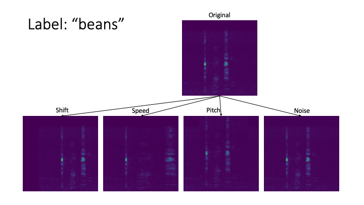
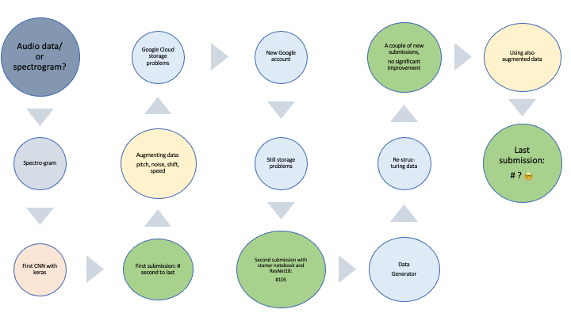

# ZINDI Coding Challenge on Keyword Spotter

This repository contains the replication material used for the coding challenge at [ZINDI](https://zindi.africa/competitions/giz-nlp-agricultural-keyword-spotter).

## Problem

Multi class classification problem of audio data

## Approach

- Convert audio data into images (spectrograms)
- Augment data (pitch, noise, shift, and speed)

- Use CNN for classification (ResNet18)

Or, if you want our work flow visually:

